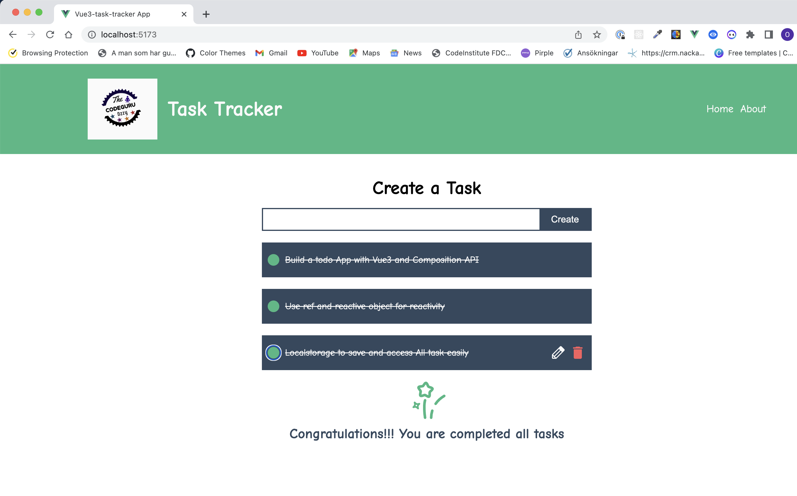

Result 

[See Deploy version on netlify](https://vue3-task-tracker.netlify.app/)


# vue3-task-tracker-app

This template should help get you started developing with Vue 3 in Vite.

## Recommended IDE Setup

[VSCode](https://code.visualstudio.com/) + [Volar](https://marketplace.visualstudio.com/items?itemName=Vue.volar) (and disable Vetur) + [TypeScript Vue Plugin (Volar)](https://marketplace.visualstudio.com/items?itemName=Vue.vscode-typescript-vue-plugin).

## Customize configuration

See [Vite Configuration Reference](https://vitejs.dev/config/).

## Project Setup

```sh
npm install
```

### Compile and Hot-Reload for Development

```sh
npm run dev
```

### Compile and Minify for Production

```sh
npm run build
```

## key notes

- reactivity ref vs reactive
to assign a ref value that can take a primitive value such as string 
reactive must be assign as object

other difference how we access these value in script tags we need to use .value with reactive

## it is not good practice to update value of prop directly on child component. we should do it on parent where the actual data is exist. On vue then we can emit a function and listen on parent component to update the value of the property that we are interested